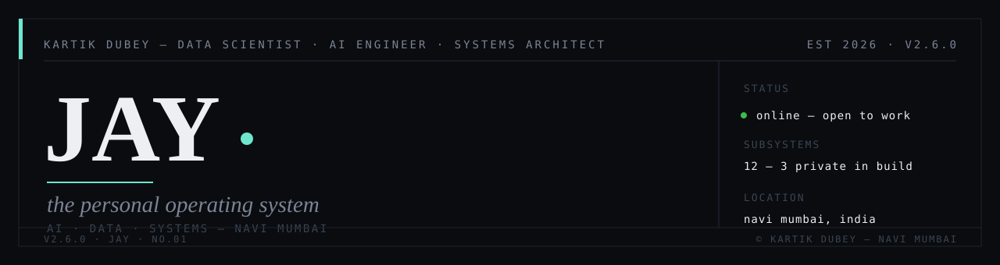
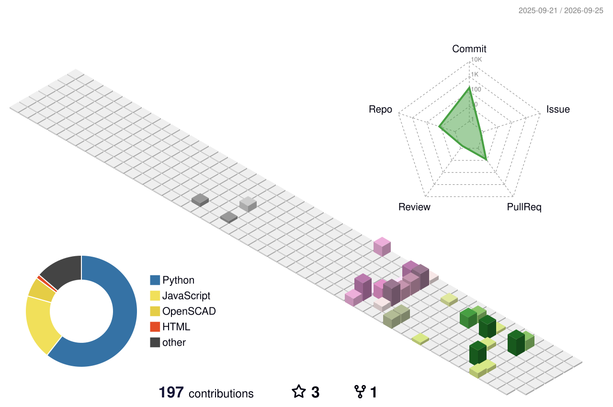

<p align="center">
  <picture>
    <source media="(prefers-color-scheme: dark)" srcset="./assets/banner-dark.svg">
    <source media="(prefers-color-scheme: light)" srcset="./assets/banner-light.svg">
    
  </picture>
</p>

```
katti-os v2.6.0 — boot sequence
[▓▓▓▓▓▓▓▓▓▓▓▓▓▓░░░░] loading kernel ............ OK
[▓▓▓▓▓▓▓▓▓▓▓▓▓▓░░░░] mounting workspaces ....... OK
[▓▓▓▓▓▓▓▓▓▓▓▓▓▓░░░░] starting services ......... OK

> user       : kartik dubey
> profile    : data scientist · ai engineer · systems architect
> location   : navi mumbai, india
> experience : tcs · reliance · independent
> focus      : agentic rag · llm systems · interactive data products
> status     : [online] · open to work
```

---

### ▶ running services

| service | status | log |
|---|---|---|
| [portfolio-ed-](https://github.com/kartikdubeycoded/portfolio-ed-) | 🟢 live | cinematic scroll portfolio · three.js + gsap + vite → [portfolio-ed-a.pages.dev](https://portfolio-ed-a.pages.dev) |
| [agentic-rag-engine](https://github.com/kartikdubeycoded/agentic-rag-engine) | 🟡 dev | offline-first agentic RAG for industrial field engineers · langgraph + qdrant + neo4j |
| [repair-chatbot](https://github.com/kartikdubeycoded/repair-chatbot) | 🟡 dev | context-aware RAG chatbot over 18,995 repair manuals · qwen · offline |
| [ugh-boardroom](https://github.com/kartikdubeycoded/ugh-boardroom) | 🟡 prototype | multi-agent boardroom — four personas deliberate a business dilemma |
| [TTM-Talk-Through-Me](https://github.com/kartikdubeycoded/TTM-Talk-Through-Me) | 🟡 dev | talk-through-me · speech interface in progress |
| [getyour-kb-right](https://github.com/kartikdubeycoded/getyour-kb-right) | 🟡 dev | knowledge-base workbench in progress |

<details>
<summary><b>🧩 sysinfo — stack</b></summary>

```
llm/rag : python · langgraph · langchain · qdrant · neo4j · ollama/qwen
ml       : pandas · numpy · scikit-learn · statistical modeling (churn, eda)
data     : sql · bigquery · spark
web/3d   : javascript · three.js · gsap · vite · matter-js · css
systems  : git · docker · linux · github actions · cloudflare pages
```
</details>

<details>
<summary><b>📊 stats</b></summary>

```
> total_commits    : growing daily
> open_source      : 9 public repos
> contributions    : building in public — steady > bursty
> note             : half the fleet is in active development, shipping as it matures
```


</details>

<details>
<summary><b>🌐 network</b></summary>

```
> portfolio : https://portfolio-ed-a.pages.dev
> linkedin  : https://www.linkedin.com/in/<your-handle>
> x         : https://x.com/<your-handle>
> email     : <your-email>@gmail.com
> hireable  : true — open to data science / AI engineering roles
```
</details>

---

<p align="center"><sub>last boot: <!--BOOT:START-->21 aug 2026, 12:00 ist<!--BOOT:END--> · </sub></p>
