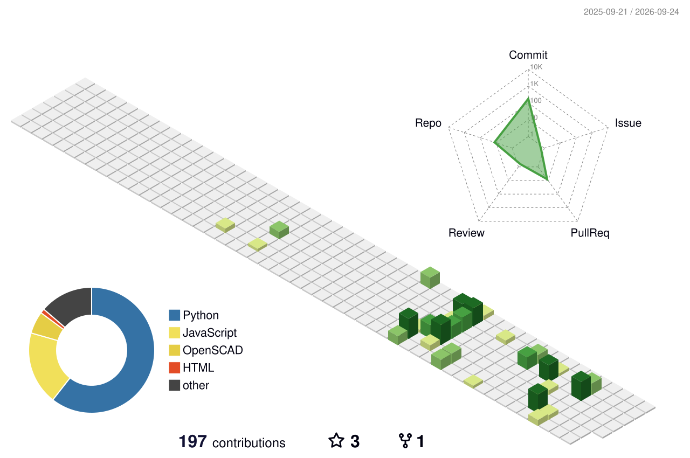

<h1 align="center">Kartik Dubey</h1>

  <b>AI / GenAI engineer — RAG, multi-agent systems, and the plumbing that makes them hold up.</b> 
  Final-year B.Tech Data Science · Navi Mumbai, India

  
  
  

---

## What I do

I build retrieval and agent systems end to end — the spec, the architecture and the code come from
the same person. Most of what I ship runs **offline or at zero external API cost**, because the
problems I've worked on were air-gapped or personal-data-sensitive.

I also build the evaluation in from the start. Signer-independent cross-validation, Recall@5
tracking, test suites — a number I can't reproduce isn't a number I'll quote.

**Currently:** final-year B.Tech, open to AI / GenAI engineering roles and freelance work.

---

## Selected work

### 🔎 [Agentic RAG Engine](https://github.com/kartikdubeycoded/agentic-rag-engine)

Grounded Q&A over technical manuals. An open-source rebuild of the offline agentic-RAG architecture
I shipped to a client at TCS, re-targeted to public Wärtsilä 32 marine-engine manuals so the whole
thing is publicly runnable. Rewrite → route → retrieve → grade over an embedded Qdrant index with
cross-encoder reranking and an optional Neo4j cascade-fault graph. **Every answer is
citation-grounded — never invented.** Five-step quickstart; no Docker, no GPU.

### 🧠 Project Jay — the orchestration layer

The system I run my other projects through. Work is dispatched to rooms, each with a manager
seat and implementation workers, and **the model is chosen per role, not per person**:
DeepSeek v4 Pro builds and reviews, `deepseek-reasoner` manages, v4 Flash does the cheap
graph and summarisation work. Room task envelopes are bounded, so a worker's full transcript
never enters a manager's context — which is what stops a long build from silently becoming a
context-window problem.

Underneath it is a state layer that had to be made honest the hard way. A session row read
`RUNNING` for 39 days because nobody ever wrote a new value; liveness is now **derived at read
time**, never stored. Token spend is counted from real transcript `usage`, deduped by message
id — one API message spans several log lines, and counting each one triples the bill.

**55 test modules. Native components run subprocess-isolated**, so a crash costs one utterance
and never the control plane.

> Repo is private — it ingests my personal notes. Happy to walk through the architecture.

### 🤟 [Talk Through Me](https://github.com/kartikdubeycoded/TTM-Talk-Through-Me)

Live sign-language → English captions on Meet / Zoom / Teams, as a Chrome extension that runs
entirely in the browser — webcam video never leaves the machine. Evaluated under **5-fold
signer-independent cross-validation** (no signer appears in both train and test): a **128-sign
shippable vocabulary at 0.64 mean per-sign accuracy**, 115 of 128 signs clearing a 0.50 floor.

### 📚 [Get Your Knowledge Right](https://github.com/kartikdubeycoded/getyour-kb-right)

A personal knowledge engine that turns the firehose you already read into decisions you act on.
Watches repos, papers, news and launches, ranks them against your topics, and pushes a digest to
your phone. Share a reel and it transcribes locally, researches it, and returns a do/skip verdict.
The point isn't more to read — it's **less to read and something to do.**

---

## Also here

| Project | What it is |
|---|---|
| [**BUDDY**](https://github.com/kartikdubeycoded/BUDDY) | Ducted-fan aircraft engineering rig — parametric OpenSCAD CAD + Python propulsion, structural and mass solvers |
| [**Get Your Hands Right**](https://github.com/kartikdubeycoded/get-your-hands-right) | Inspect a 3D model with your bare hands via webcam — MediaPipe landmarks drive rotate/scale/place, plus a real-time filter stack (thermal, night vision, edges) |
| [**Repair Chatbot**](https://github.com/kartikdubeycoded/repair-chatbot) | Offline RAG over 18,995 repair manuals — the earlier, simpler ancestor of the Agentic RAG Engine |
| [**Portfolio**](https://github.com/kartikdubeycoded/portfolio-ed-) | Cinematic scroll-driven site — Three.js + GSAP + Vite · [live](https://portfolio-ed-a79.pages.dev) |
| [**ugh-boardroom**](https://github.com/kartikdubeycoded/ugh-boardroom) | UI prototype: a multi-agent boardroom where four personas deliberate a decision |
| [**nucdesal**](https://github.com/kartikdubeycoded/nucdesal) | Could India's planned 100 GW nuclear fleet desalinate seawater with its reject heat? A cited physics model, 415 tests, every reference number re-derived |
| [**real-estate-splat**](https://github.com/kartikdubeycoded/real-estate-splat) | 3D walkthroughs of flats from an ordinary phone — IMU pose + monocular metric depth + fusion, then a three.js viewer |
| [**Paper World**](https://github.com/kartikdubeycoded/paper-world) | 15 paper-trading agents on live Binance data, with a planted control group so the swarm's "learning" is falsifiable |
| [**facelessVideos**](https://github.com/kartikdubeycoded/facelessVideos) | Script → voice → B-roll → subtitles → rendered 9:16 short, end to end |

---

## Private work

Two engines I run on my own data. Both repos are private for the same reason Jay's is — they
hold real people's details and my own — but the design is the interesting part and I'm glad
to walk through either.

**Get Your Leads Right** — turns a business's public digital footprint into a defensible
reason to make a specific phone call. The rule the whole system enforces in code is *no
receipt, no claim*: every fact carries a provenance tier and a source URL, there is no path
that writes an attribute without one, and a fact nobody published is `null` rather than
`false`. Deterministic scrapers with robots enforcement feed a provenance graph; a rubric
turns signals into a fit score with a written reason. 145 tests, zero LLM calls in the
collection layer.

**Get Your Job Right** — the same idea pointed at my own pipeline: sweep listings, rank them
against a profile, draft the application, and track what actually happened to each one.

---

## Experience

**Tata Consultancy Services** — AI Systems & Automation · *Jan – Apr 2026*
Shipped an air-gapped agentic RAG assistant to **350+ fab engineers** at an offshore semiconductor
client, replacing 10,000+ pages of OEM manuals and cutting troubleshooting from ~40 min to <10 min
per incident, at zero external LLM API cost. **Recall@5: 0.61 → 0.89.**

**Reliance Jio** — Data Science Intern, Network Analytics · *Jun – Jul 2025*
Churn models across 20+ cohorts drawn from a **440M-record** base (0.838 ROC-AUC, XGBoost);
distributed EDA over 200+ variables in Spark.

---

## Stack

---

<picture>
  <source media="(prefers-color-scheme: dark)" srcset="./profile-3d-contrib/profile-night-green.svg">
  <source media="(prefers-color-scheme: light)" srcset="./profile-3d-contrib/profile-green.svg">
  
</picture>

---

  <a href="https://portfolio-ed-a79.pages.dev">portfolio</a> ·
  <a href="https://linkedin.com/in/kartik-dubey-80b100293">linkedin</a> ·
  <a href="mailto:kartikdubey1934@gmail.com">kartikdubey1934@gmail.com</a>

last boot <!--BOOT:START-->25 Aug 2026, 00:53 ist<!--BOOT:END-->

