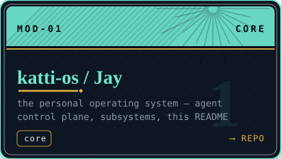
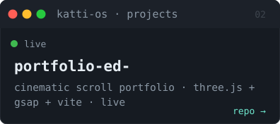
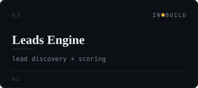
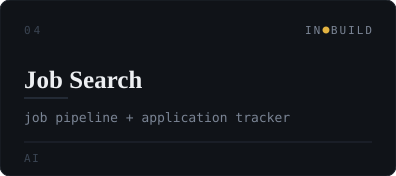
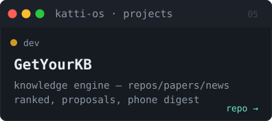
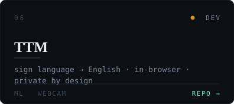
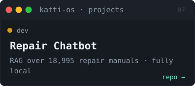
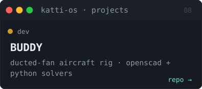

<p align="center">
  <picture>
    <source media="(prefers-color-scheme: dark)" srcset="./assets/banner-dark.svg">
    <source media="(prefers-color-scheme: light)" srcset="./assets/banner-light.svg">
    
  </picture>
</p>

```
katti-os v2.6.0 — boot sequence
[▓▓▓▓▓▓▓▓▓▓▓▓▓▓░░░░] loading kernel ............ OK
[▓▓▓▓▓▓▓▓▓▓▓▓▓▓░░░░] mounting subsystems ....... OK
[▓▓▓▓▓▓▓▓▓▓▓▓▓▓░░░░] starting services ......... OK

> user       : kartik dubey
> core       : katti-os — the personal operating system (in build)
> profile    : data scientist · ai engineer · systems architect
> location   : navi mumbai, india
> experience : tcs · reliance · independent · freelance clients
> status     : [online] · open to work
```

### projects

<table align="center" cellpadding="8" cellspacing="0">
  <tr>
    <td><a href="https://github.com/kartikdubeycoded/Jay"><picture><source media="(prefers-color-scheme: dark)" srcset="./assets/card-01-katti-os-jay-dark.svg"><source media="(prefers-color-scheme: light)" srcset="./assets/card-01-katti-os-jay-light.svg"></picture></a></td>
    <td><a href="https://github.com/kartikdubeycoded/portfolio-ed-"><picture><source media="(prefers-color-scheme: dark)" srcset="./assets/card-02-portfolio-ed-dark.svg"><source media="(prefers-color-scheme: light)" srcset="./assets/card-02-portfolio-ed-light.svg"></picture></a></td>
    <td><picture><source media="(prefers-color-scheme: dark)" srcset="./assets/card-03-leads-engine-dark.svg"><source media="(prefers-color-scheme: light)" srcset="./assets/card-03-leads-engine-light.svg"></picture></td>
  </tr>
  <tr>
    <td><picture><source media="(prefers-color-scheme: dark)" srcset="./assets/card-04-job-search-dark.svg"><source media="(prefers-color-scheme: light)" srcset="./assets/card-04-job-search-light.svg"></picture></td>
    <td><a href="https://github.com/kartikdubeycoded/getyour-kb-right"><picture><source media="(prefers-color-scheme: dark)" srcset="./assets/card-05-getyourkb-dark.svg"><source media="(prefers-color-scheme: light)" srcset="./assets/card-05-getyourkb-light.svg"></picture></a></td>
    <td><a href="https://github.com/kartikdubeycoded/TTM-Talk-Through-Me"><picture><source media="(prefers-color-scheme: dark)" srcset="./assets/card-06-ttm-dark.svg"><source media="(prefers-color-scheme: light)" srcset="./assets/card-06-ttm-light.svg"></picture></a></td>
  </tr>
  <tr>
    <td><a href="https://github.com/kartikdubeycoded/repair-chatbot"><picture><source media="(prefers-color-scheme: dark)" srcset="./assets/card-07-repair-chatbot-dark.svg"><source media="(prefers-color-scheme: light)" srcset="./assets/card-07-repair-chatbot-light.svg"></picture></a></td>
    <td><a href="https://github.com/kartikdubeycoded/BUDDY"><picture><source media="(prefers-color-scheme: dark)" srcset="./assets/card-08-buddy-dark.svg"><source media="(prefers-color-scheme: light)" srcset="./assets/card-08-buddy-light.svg"></picture></a></td>
    <td><picture><source media="(prefers-color-scheme: dark)" srcset="./assets/card-09-webstudios-dark.svg"><source media="(prefers-color-scheme: light)" srcset="./assets/card-09-webstudios-light.svg"></picture></td>
  </tr>
</table>

<details>
<summary><b>more</b></summary>

```
- ugh-boardroom        — multi-agent boardroom UI prototype
- video pipeline       — free video generation + auto-clipping
- ARMenuX              — AR restaurant menu (client work, private)
- get-your-hands-right — placeholder (reserved)
```
</details>

<details>
<summary><b>sysinfo — stack</b></summary>

```
llm/rag : python · langgraph · langchain · qdrant · neo4j · ollama/qwen
ml       : pandas · numpy · scikit-learn · statistical modeling (churn, eda)
data     : sql · bigquery · spark
web/3d   : javascript · three.js · gsap · vite · matter-js · css
agents   : agent harnesses · control planes · multi-agent deliberation
hardware : openscad · parametric CAD · python solvers
systems  : git · docker · linux · github actions · cloudflare pages
```
</details>

<details>
<summary><b>stats</b></summary>

```
> open_source : 9 public repos · 3 private in build
> status      : core + subsystems shipping as they mature
```


</details>

<details>
<summary><b>network</b></summary>

```
> portfolio : https://portfolio-ed-a.pages.dev
> linkedin  : https://www.linkedin.com/in/<your-handle>
> x         : https://x.com/<your-handle>
> email     : <your-email>@gmail.com
> hireable  : true — data science · AI engineering · freelance clients welcome
```
</details>

---

<p align="center"><sub>last boot: <!--BOOT:START-->21 aug 2026, 12:00 ist<!--BOOT:END--> · </sub></p>
